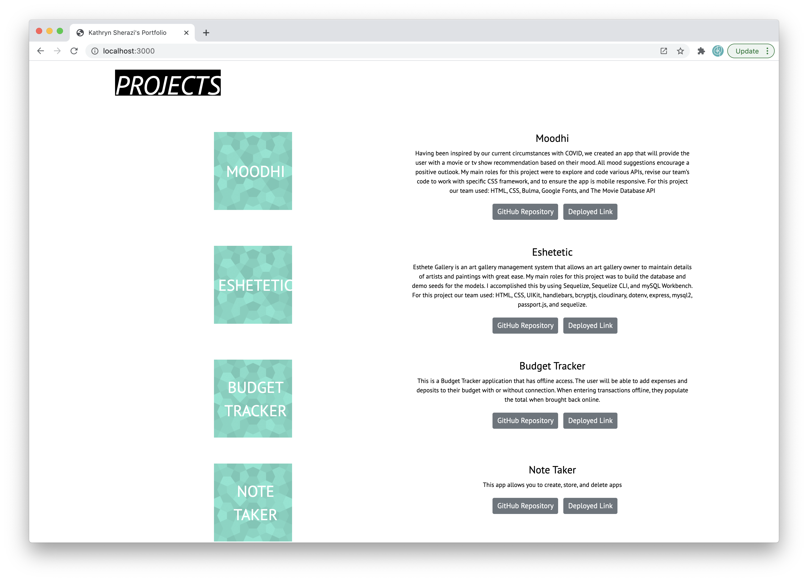

  # Project: Employee Directory
  

  # Description: 
    This site is a practice in React JS. The goal of the assignment was to make a professional website in React. 
  
  # Table of Contents:
  
  * [Title](#Project)
  * [Description](#Description)
  * [Installation](#Installation) 
  * [Usage](#User-Story)
  * [What is Next](#What-is-Next)
  * [What I learned](#What-I-Learned) 
  * [Questions](#Questions)
  * [Useful Links](#Useful-Links)
  
  

  # Installation 
  This is an ReactJS app and uses bootstrap, react, react-dom, and react-scripts

  # User-Story 
  The layout of this page is very simple. There is no necessary steps needed to launch the app. Please follow the link below. When opening the deployed link, you will view and introduction of the site with an about section. If the user scrolls down further, they will discover a list of project and assignment examples

  

  # What is Next 
  Moving forward I would like to explore position in React. I believe this is an area I could improve in. I would also like to add more projects and possibly some more annimation to the elements to make the site a bit more dynamic.

  # What I learned 
  This assignment was a great opportunity to explore React. I really used it as an opportunity to add and remove elements to see how I can work with them. Through this I have been able to see what areas of creating a react site, require more attention. I also learned a lot about the necessary file structure and a window into the files that are previded with the react template, and what they do.

  # Questions 
  Github Username: kecoston If you have any question, you can email me at: kecoston@gmail.com

  # Useful Links

  GitHub Repository: https://github.com/kecoston/professional-portfolio
  
  Deployed Link: https://kecoston.github.io/professional-portfolio/

  # Licensing 

  Employee Directory  Copyright (C) 2020 kecoston

  
