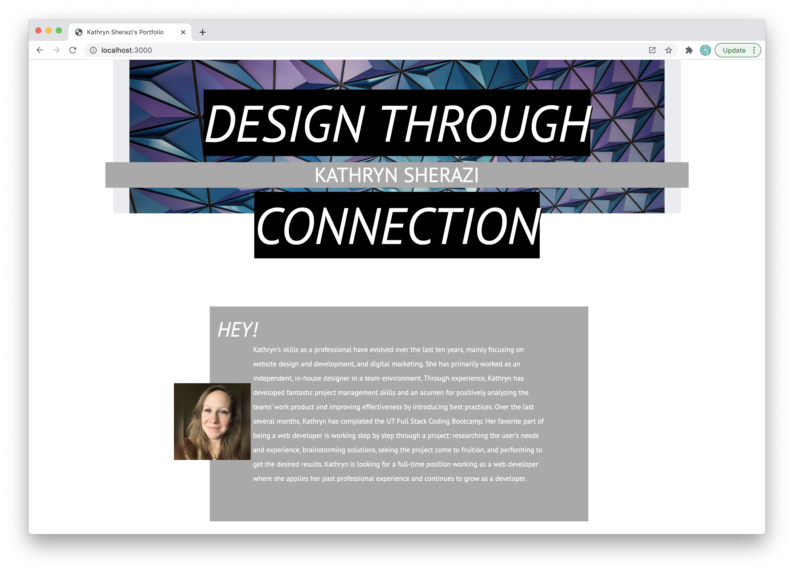
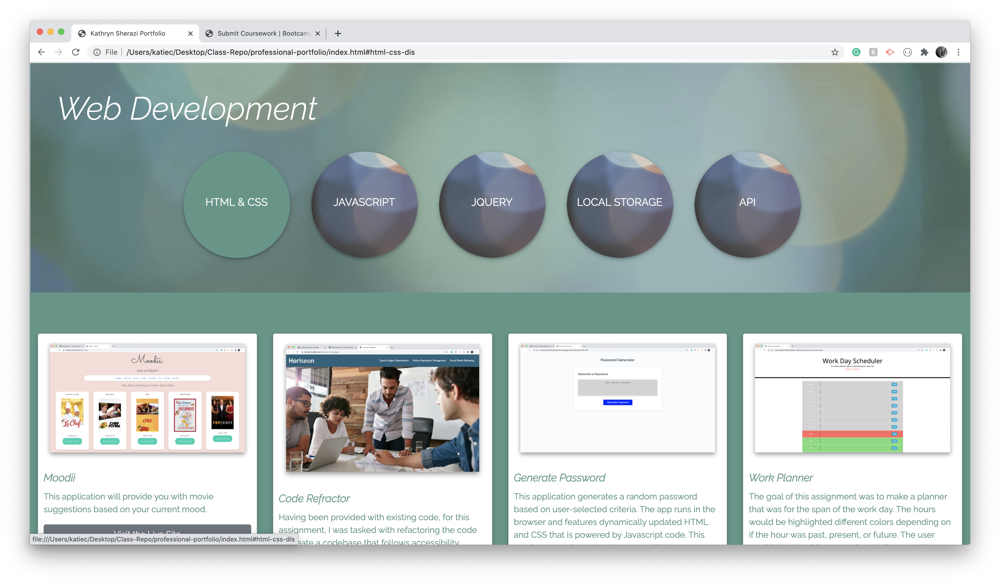

#Professional Portfolio

  # Description: 
  
    This site is a practice in React JS. The goal of the assignment was to make a professional website in React. 
  
  # Table of Contents:
  
  * [Title](#Project)
  * [Description](#Description)
  * [Installation](#Installation) 
  * [Usage](#User-Story)
  * [What is Next](#What-is-Next)
  * [What I learned](#What-I-Learned) 
  * [Questions](#Questions)
  * [Useful Links](#Useful-Links)
  
  

This project will act as my professional portfolio, which will contain the projects and assignments created throughout the UTA coding Bootcamp. I have also included several projects that I have done as a graphic designer in the past. The site is a single page divided into three major parts. It has an opening that quickly directs the user to the projects they would like to view. I have divided both web development and graphic design into categories. When the user selects the grouping they'd like to view, they appear in the same layer. 

# What did I Learn

I was a little too excited to dive into jquery for the functionality of this site. After problem-solving through some code, I realized it was best to keep some elements as html and css. For the first time, I worked with the toggle(), hide(), and show() methods in jquery. This was also the first time I put together a group of objects and pulled from them using a loop. 

# What is the Next Step

I need to resolve several issues with the site. It is currently not mobile responsive. I believe there is an issue with the layer positioning. When the site is not in full screen or shrunk down, the divs shift out of order. Currently, I have only one category working under html and css. I am looking forward to completing the other categories. I would also like the button to show in the active state. After seeing the cards come to life, I am unsure how I would like to display everything, I will be exploring bootstraps media-list next. Lastly, while I am very excited about the video at the top of the page, this layer needs some work; it seems to stretch the length of the page. 

# Links 

git repository: https://github.com/kecoston/professional-portfolio
live site: https://kecoston.github.io/professional-portfolio/
